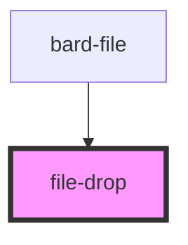

# file-drop

<!-- Auto Generated Below -->

## Properties

| Property | Attribute | Description                                                  | Type     | Default     |
| -------- | --------- | ------------------------------------------------------------ | -------- | ----------- |
| `target` | `target`  | The id of the an input[type=file] to assign dropped files to | `string` | `undefined` |

## Dependencies

### Used by

 - [bard-file](../bard-file)

### Graph

----------------------------------------------

*Built with [StencilJS](https://stenciljs.com/)*
