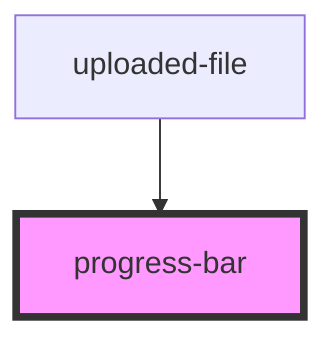

# progress-bar

<!-- Auto Generated Below -->

## Properties

| Property  | Attribute | Description | Type     | Default |
| --------- | --------- | ----------- | -------- | ------- |
| `percent` | `percent` |             | `number` | `0`     |

## Dependencies

### Used by

 - [uploaded-file](../uploaded-file)

### Graph

----------------------------------------------

*Built with [StencilJS](https://stenciljs.com/)*
