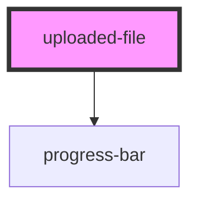

# uploaded-file

<!-- Auto Generated Below -->

## Properties

| Property   | Attribute  | Description | Type     | Default     |
| ---------- | ---------- | ----------- | -------- | ----------- |
| `accepts`  | `accepts`  |             | `string` | `undefined` |
| `filename` | `filename` |             | `string` | `undefined` |
| `max`      | `max`      |             | `number` | `undefined` |
| `mimetype` | `mimetype` |             | `string` | `undefined` |
| `name`     | `name`     |             | `string` | `undefined` |
| `size`     | `size`     |             | `number` | `undefined` |
| `src`      | `src`      |             | `string` | `undefined` |
| `value`    | `value`    |             | `string` | `undefined` |

## Events

| Event    | Description | Type               |
| -------- | ----------- | ------------------ |
| `remove` |             | `CustomEvent<any>` |

## Dependencies

### Depends on

- [progress-bar](../progress-bar)

### Graph

----------------------------------------------

*Built with [StencilJS](https://stenciljs.com/)*
