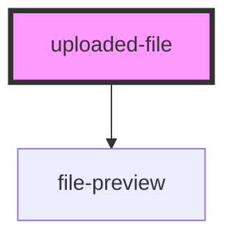

# uploaded-file

<!-- Auto Generated Below -->

## Properties

| Property            | Attribute            | Description | Type      | Default      |
| ------------------- | -------------------- | ----------- | --------- | ------------ |
| `accepts`           | `accepts`            |             | `string`  | `undefined`  |
| `filename`          | `filename`           |             | `string`  | `undefined`  |
| `filetype`          | `filetype`           |             | `string`  | `undefined`  |
| `max`               | `max`                |             | `number`  | `undefined`  |
| `name`              | `name`               |             | `string`  | `undefined`  |
| `percent`           | `percent`            |             | `number`  | `100`        |
| `preview`           | `preview`            |             | `boolean` | `true`       |
| `size`              | `size`               |             | `number`  | `undefined`  |
| `src`               | `src`                |             | `string`  | `undefined`  |
| `state`             | `state`              |             | `string`  | `"complete"` |
| `url`               | `url`                |             | `string`  | `undefined`  |
| `validationMessage` | `validation-message` |             | `string`  | `undefined`  |
| `value`             | `value`              |             | `string`  | `""`         |

## Events

| Event                  | Description | Type               |
| ---------------------- | ----------- | ------------------ |
| `uploaded-file:remove` |             | `CustomEvent<any>` |

## Dependencies

### Depends on

- [file-preview](../file-preview)

### Graph

----------------------------------------------

*Built with [StencilJS](https://stenciljs.com/)*
